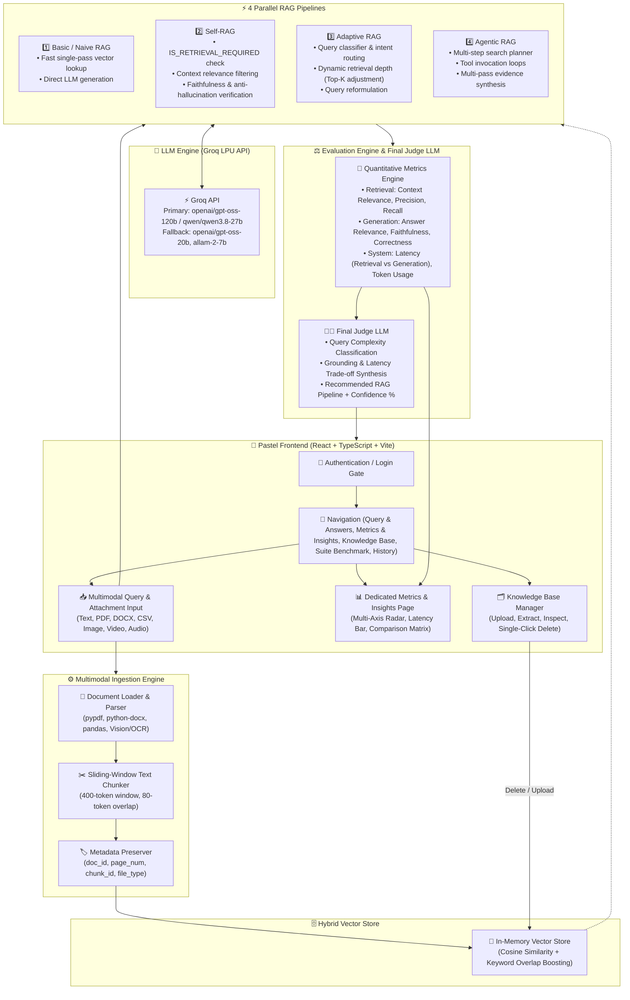

# 📘 Multimodal RAG Evaluation & Selection Framework — Complete Project Reference

## 🌟 Executive Summary
This application is an end-to-end framework for evaluating, comparing, and intelligently selecting between multiple Retrieval-Augmented Generation (RAG) architectures:
1. **Basic / Naive RAG**: Fast single-pass vector lookup and direct generation.
2. **Self-RAG**: Dynamic self-reflection (retrieval necessity, context relevance filtering, and anti-hallucination verification).
3. **Adaptive RAG**: Dynamic query classification, strategy routing, and adaptive top-$k$ depth.
4. **Agentic RAG**: Autonomous multi-step planner, tool invocation loops, and multi-source evidence synthesis.

The system features a **Final Judge LLM Decision Engine** that evaluates quantitative metrics and query complexity to output the optimal RAG architecture recommendation with confidence scores and detailed trade-off explanations.

---

## 🏛️ System Architecture



---

## 🔑 Key Features & User Flow

### 1. 🔐 Authentication First
- Clean pastel login page before dashboard access.
- User session persistence and logout capability.

### 2. 📥 Multimodal Query & Attachment Support
- Natural language queries or direct file attachments via the paperclip button in the query box.
- Supported file types: **PDF, Word (.docx), TXT, CSV, Images (OCR), Video transcripts, Audio transcripts, and pasted raw text notes**.
- Granular metadata preservation (`doc_id`, `filename`, `page_number`, `chunk_id`, and `content_type`).

### 3. ⚡ Parallel Execution Across 4 RAG Pipelines
- **Basic RAG**: Standard single-pass vector lookup.
- **Self-RAG**: Reflection steps evaluating context relevance and grounded verification.
- **Adaptive RAG**: Dynamic reformulation and depth adjustment based on query classification.
- **Agentic RAG**: Deconstructs questions into sub-queries with tool search loops and synthesis.

### 4. 🎯 Answer Delivery & Architecture Recommendation
- **First**: Grounded final answer with source citations (filename, exact page number, and similarity score) and individual answer tabs.
- **Later**: Final Judge architecture recommendation with confidence percentage and detailed trade-off reasoning.

### 5. 📊 Dedicated Metrics & Insights Page
- Complete quantitative metrics table for all 4 pipelines.
- **Multi-Axis Radar Chart** comparing Faithfulness, Answer Relevance, Context Precision, and Correctness.
- **Latency Bar Chart** comparing Retrieval time vs Generation time.
- Analytical trade-offs matrix and export to Markdown/CSV.

### 6. 🗂️ Knowledge Base with Single-Click Deletion
- High-fidelity PDF and document text extraction.
- View document metadata (type, size, page count, chunks).
- Single-click **Delete** button per document with instant vector index cleanup.

### 7. 🚀 Groq High-Speed API Integration
- Primary Model: `openai/gpt-oss-120b` and `qwen/qwen3.8-27b`.
- Automatic failover across active Groq models for 100% reliable responses.

---

## 🛠️ How to Run

1. **Start Backend**:
   ```powershell
   cd backend
   uvicorn app.main:app --reload --port 8000
   ```

2. **Start Frontend**:
   ```powershell
   cd frontend
   npm run dev
   ```

3. **Access Application**:
   Open **`http://localhost:3000`** in your browser.
