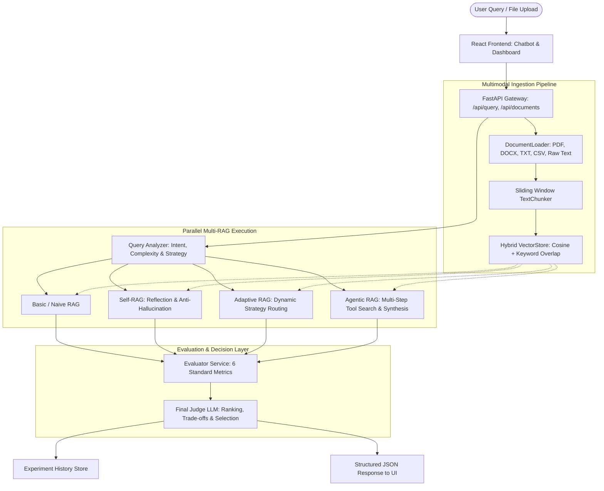

# Project Requirements Document (PRD)

**Project Name:** Unified Multimodal RAG Evaluation & Query-Adaptive RAG Selection Framework  
**Document Version:** 1.0  
**Status:** Active / Production-Ready Research Framework  
**Reference Codebase:** [backend/app/main.py](file:///c:/Users/uppal/OneDrive/Desktop/multimodal_rag_framework/backend/app/main.py), [frontend/src/App.tsx](file:///c:/Users/uppal/OneDrive/Desktop/multimodal_rag_framework/frontend/src/App.tsx)

---

## 1. Executive Summary & Core Research Vision

### 1.1 Problem Statement
In modern generative AI applications, developers face a wide array of Retrieval-Augmented Generation (RAG) paradigms—from naive vector lookup to self-reflective filtering and autonomous multi-agent tool loops. While complex RAG architectures promise higher accuracy, they introduce substantial latency, token costs, and algorithmic overhead. Conversely,simple naive RAG is fast and lightweight, but suffers from severe hallucinations, missing context in multi-hop queries, and low context precision.

No single RAG architecture is universally optimal for every user query.

### 1.2 Core Research Question
> *"Given a particular user query, which RAG architecture provides the best answer, and why?"*

### 1.3 System Vision
The **Unified Multimodal RAG Evaluation and Query-Adaptive RAG Selection Framework** is a research-grade, full-stack platform designed to:
1. Concurrently execute user queries across **four standard-setting RAG architectures**.
2. Score each pipeline across quantitative retrieval, generation, and operational metrics.
3. Employ a dedicated **Final Judge LLM Decision Engine** that analyzes query complexity, balances trade-offs (accuracy vs. latency), and selects the winning architecture with a structured rationale.
4. Provide both an interactive conversational assistant and an analytical research dashboard for comparative experimentation and benchmarking.

---

## 2. System Architecture & High-Level Flow



---

## 3. User Personas & Use Cases

| Persona | Needs & Goals | Key Platform Capabilities Used |
| :--- | :--- | :--- |
| **AI / NLP Researcher** | Evaluate empirical performance and trade-offs of RAG strategies under controlled conditions. | Benchmark test suite runner, empirical win rates, detailed execution traces, radar/bar comparison charts. |
| **Enterprise AI Engineer** | Determine whether complex agentic or self-reflective RAG justifies token cost and latency for their workload. | Comparison table, latency vs. faithfulness scoring, token consumption metrics, offline demo fallback. |
| **End User / Domain Expert** | Ingest custom corporate knowledge (PDFs, reports, notes) and receive accurate, grounded, cited answers. | Interactive Chatbot with document upload, cited source cards, page-level attribution chips. |

---

## 4. Functional Requirements

### 4.1 Multimodal Document Ingestion & Storage
- **FR-1.1 File Ingestion**: Ingest multi-format documents via [document_loader.py](file:///c:/Users/uppal/OneDrive/Desktop/multimodal_rag_framework/backend/app/ingestion/document_loader.py), supporting:
  - Portable Document Format (`.pdf`) with page-by-page text extraction.
  - Microsoft Word Documents (`.docx`).
  - Text Files (`.txt`) and Tabular Data (`.csv`).
  - Multimodal images with OCR/vision metadata fallbacks.
- **FR-1.2 Direct Text Ingestion**: Dedicated endpoint (`POST /api/documents/text`) and UI form allowing users to paste unformatted raw text notes directly into the knowledge base.
- **FR-1.3 Sliding-Window Chunking**: Configurable token-aware chunking via [chunker.py](file:///c:/Users/uppal/OneDrive/Desktop/multimodal_rag_framework/backend/app/ingestion/chunker.py) (default chunk size: 500 characters, overlap: 50 characters) preserving metadata: `doc_id`, `filename`, `page_number`, `source_type`, and `content_type`.
- **FR-1.4 Hybrid Vector Database**: Vector store implemented in [vector_store.py](file:///c:/Users/uppal/OneDrive/Desktop/multimodal_rag_framework/backend/app/retrieval/vector_store.py) combining:
  - Vector cosine similarity ($0.65$ weight).
  - Keyword overlap score ($0.35$ weight) for lexical precision.
- **FR-1.5 Document Management**: View all indexed documents, inspect page/chunk counts, and delete specific corpora on demand.

### 4.2 Multi-RAG Pipeline Implementations
The platform supports four discrete RAG pipelines inheriting from [base_rag.py](file:///c:/Users/uppal/OneDrive/Desktop/multimodal_rag_framework/backend/app/rag/base_rag.py):

```
                                  ┌───► [Basic RAG] (Single-pass lookup)
                                  ├───► [Self-RAG] (Dynamic self-reflection tokens)
User Query ──► Query Analyzer ────┼───► [Adaptive RAG] (Query reformulation & dynamic top-k)
                                  └───► [Agentic RAG] (Autonomous multi-tool sub-searches)
```

1. **Basic / Naive RAG** ([basic_rag.py](file:///c:/Users/uppal/OneDrive/Desktop/multimodal_rag_framework/backend/app/rag/basic_rag.py)):
   - Single-pass dense vector retrieval with Top-$K$ chunks.
   - Direct prompt injection into the answer generator.
   - Lowest operational latency; serves as the baseline control.
2. **Self-RAG** ([self_rag.py](file:///c:/Users/uppal/OneDrive/Desktop/multimodal_rag_framework/backend/app/rag/self_rag.py)):
   - Dynamic retrieval gate (`IS_RETRIEVAL_REQUIRED`).
   - Retrieved passage filtering (`IS_CONTEXT_RELEVANT`).
   - Anti-hallucination verification step (`IS_ANSWER_SUPPORTED_BY_CONTEXT`) prior to returning final output.
3. **Adaptive RAG** ([adaptive_rag.py](file:///c:/Users/uppal/OneDrive/Desktop/multimodal_rag_framework/backend/app/rag/adaptive_rag.py)):
   - Classifies query into categories (e.g., `simple_factual`, `comparative`, `multi_document`, `analytical`).
   - Automatically recalibrates retrieval depth (dynamic Top-$K$) and performs automated query reformulation.
4. **Agentic RAG** ([agentic_rag.py](file:///c:/Users/uppal/OneDrive/Desktop/multimodal_rag_framework/backend/app/rag/agentic_rag.py)):
   - Autonomous multi-step planner.
   - Deconstructs queries into sub-questions, issues targeted tool queries to the vector index, and cross-synthesizes multi-source evidence.

### 4.3 Evaluation & Metrics Engine
The evaluation layer in [evaluator.py](file:///c:/Users/uppal/OneDrive/Desktop/multimodal_rag_framework/backend/app/evaluation/evaluator.py) calculates six standardized evaluation metrics for every executed architecture:

| Metric Category | Metric Name | Definition / Mathematical Formulation |
| :--- | :--- | :--- |
| **Retrieval** | **Context Relevance** | Ratio of relevant sentences in retrieved chunks to total retrieved sentences. |
| **Retrieval** | **Context Precision** | Precision@K measuring how early relevant passages appear in retrieved ranking. |
| **Generation** | **Answer Relevance** | Lexical and semantic overlap between the generated response and user query intent. |
| **Generation** | **Faithfulness** | Ratio of generated claims directly supported by retrieved evidence (anti-hallucination score). |
| **Generation** | **Correctness** | Factual grounding score when benchmark ground-truth answers are supplied. |
| **System** | **Efficiency & Latency** | Breakdown of retrieval time, generation time, total pipeline latency, and LLM call counts. |

- **Weighted Overall Quality Score**: Normalized composite score calculated as:
$$\text{Score} = 0.25 \times \text{Faithfulness} + 0.20 \times \text{AnswerRelevance} + 0.20 \times \text{ContextRelevance} + 0.25 \times \text{Correctness} + 0.10 \times \text{Efficiency}$$

### 4.4 Final Judge LLM & Recommendation Engine
- Implemented in [judge.py](file:///c:/Users/uppal/OneDrive/Desktop/multimodal_rag_framework/backend/app/evaluation/judge.py).
- Weighs query complexity against accuracy requirements and latency budgets.
- Selects the single **Recommended Architecture** and provides:
  - Overall confidence score ($0.0 - 1.0$).
  - Full-text human-readable architectural justification.
  - Complete ranking matrix ($1^{\text{st}}$ to $4^{\text{th}}$ place).
  - Explicit comparative trade-off explanations (e.g., *Adaptive RAG vs. Basic RAG*, *Adaptive RAG vs. Agentic RAG*).

### 4.5 User Interface & Experience
- **Interactive Chatbot** ([Chatbot.tsx](file:///c:/Users/uppal/OneDrive/Desktop/multimodal_rag_framework/frontend/src/components/Chatbot.tsx)):
  - Conversational messaging interface with live dual-stage status (`Generating...` $\rightarrow$ `Evaluating all RAGs...`).
  - Integrated attachment button for instantaneous file ingestion directly from the chat input.
  - Expandable evaluation breakdown card for every assistant message.
- **Evaluation Dashboard** ([App.tsx](file:///c:/Users/uppal/OneDrive/Desktop/multimodal_rag_framework/frontend/src/App.tsx)):
  - Multi-architecture selector checkboxes (run any subset of the 4 RAGs).
  - Prominent Final Judge Recommendation Panel ([RecommendationPanel.tsx](file:///c:/Users/uppal/OneDrive/Desktop/multimodal_rag_framework/frontend/src/components/RecommendationPanel.tsx)).
  - Metrics comparison table ([ComparisonTable.tsx](file:///c:/Users/uppal/OneDrive/Desktop/multimodal_rag_framework/frontend/src/components/ComparisonTable.tsx)) highlighting the winner.
  - Interactive Recharts bar and radar charts ([MetricsCharts.tsx](file:///c:/Users/uppal/OneDrive/Desktop/multimodal_rag_framework/frontend/src/components/MetricsCharts.tsx)).
  - Deep-dive execution trace, step breakdown, and cited passages ([ArchitectureDetails.tsx](file:///c:/Users/uppal/OneDrive/Desktop/multimodal_rag_framework/frontend/src/components/ArchitectureDetails.tsx)).
- **Batch Benchmark Mode** ([BenchmarkMode.tsx](file:///c:/Users/uppal/OneDrive/Desktop/multimodal_rag_framework/frontend/src/components/BenchmarkMode.tsx)):
  - Executes batch test suites across diverse query categories.
  - Computes empirical **Architecture Win Rates** (e.g., Adaptive: 42%, Self-RAG: 27%).
- **Experiment History** ([HistoryView.tsx](file:///c:/Users/uppal/OneDrive/Desktop/multimodal_rag_framework/frontend/src/components/HistoryView.tsx)):
  - Chronological log of past query executions for inspection and reproduction.

---

## 5. Non-Functional Requirements (NFRs)

### 5.1 Performance & Latency
- **Sub-Second Offline Latency**: In demo / local fallback mode, the end-to-end multi-RAG execution and evaluation completes in $< 1.0$ second.
- **Live LLM Execution**: When external APIs (Gemini, OpenAI, Ollama) are connected, parallelize retrieval and enforce a configurable `LLM_TIMEOUT` (default: 60s).

### 5.2 Fault-Tolerance & High Availability
- **Pipeline Isolation**: If an individual RAG architecture encounters an error or network timeout, other pipelines must proceed uninterrupted; the failed pipeline is marked with `status: "failed"` and scored accordingly without crashing the server.
- **Zero-Dependency Offline Demo Mode**: If no LLM API keys are configured, the framework automatically switches to `demo` mode using [answer_generator.py](file:///c:/Users/uppal/OneDrive/Desktop/multimodal_rag_framework/backend/app/services/answer_generator.py), synthesizing answers from indexed document sentences.

### 5.3 Modularity & Extensibility
- **Standardized Base Interface**: New RAG architectures (e.g., Corrective RAG, Graph RAG) can be integrated simply by extending `BaseRAGPipeline`.
- **Pluggable LLM Backends**: Seamless switching between Google Gemini, OpenAI, Anthropic, and local Ollama instances via `.env` configuration.

### 5.4 Visual Aesthetics & Accessibility
- **Pastel Color Theme**: Consistent soft pastel design system (`#e0f2fe`, `#dcfce7`, `#fef3c7`, `#f3e8ff`, neutral slate `#1e293b`).
- **Zero Gradients**: Professional, clean, distraction-free aesthetic with high contrast ratios and clear typography.

---

## 6. Technical Stack & Infrastructure

```
┌─────────────────────────────────────────────────────────────┐
│                       Frontend Stack                        │
├─────────────────────┬───────────────────────────────────────┤
│ Framework           │ React 18 (TypeScript)                 │
│ Build Tool          │ Vite 5.1                              │
│ Styling             │ Tailwind CSS 3.4 (Pastel System)      │
│ Visualizations      │ Recharts 2.12 (Radar & Bar Charts)    │
│ Iconography         │ Lucide React                          │
└─────────────────────┴───────────────────────────────────────┘
                                ▲
                                │ REST API (CORS enabled)
                                ▼
┌─────────────────────────────────────────────────────────────┐
│                       Backend Stack                         │
├─────────────────────┬───────────────────────────────────────┤
│ Language & Runtime  │ Python 3.10+ / FastAPI / Uvicorn      │
│ Validation & Models │ Pydantic 1.10 / 2.0                   │
│ Parsing & Ingestion │ PyPDF, python-docx, Pillow, Pandas    │
│ Embeddings & Store  │ all-MiniLM-L6-v2 / Hybrid VectorStore │
│ Model Providers     │ Google Gemini, OpenAI, Ollama, Demo   │
└─────────────────────┴───────────────────────────────────────┘
```

---

## 7. Data Models & API Contracts

### 7.1 Key Endpoints

| Method | Endpoint | Description | Request Body | Response Model |
| :--- | :--- | :--- | :--- | :--- |
| `GET` | `/api/health` | Health check, document counts, provider status. | None | `HealthStatus` |
| `POST` | `/api/documents/upload` | Ingests file (PDF, TXT, DOCX, CSV, image). | Multipart `file` | `UploadResponse` |
| `POST` | `/api/documents/text` | Ingests raw text note directly into index. | `TextInputRequest` | `UploadResponse` |
| `GET` | `/api/documents` | Lists all indexed documents and metadata. | None | `List[DocumentMetadata]` |
| `DELETE` | `/api/documents/{doc_id}` | Deletes document and its chunks. | None | Status message |
| `POST` | `/api/query` | Executes multi-RAG pipelines, evaluation, and Final Judge. | `QueryRequest` | `PipelineExecutionResponse` |
| `GET` | `/api/history` | Retrieves historical query execution records. | None | `List[PipelineExecutionResponse]` |
| `POST` | `/api/benchmark` | Runs batch benchmark suite and computes win rates. | `BenchmarkRequest` | `BenchmarkResponse` |

---

## 8. Current Implementation Status vs. Future Roadmap

### 8.1 Completed Milestones (v1.0.0)
- [x] Multi-format ingestion (PDF, DOCX, TXT, CSV) & raw text note endpoint.
- [x] Hybrid vector-cosine + keyword retrieval database.
- [x] Four functioning RAG pipelines: Basic, Self-RAG, Adaptive RAG, and Agentic RAG.
- [x] Standardized evaluation engine computing 6 metrics.
- [x] Final Judge LLM decision engine with analytical trade-off generation.
- [x] Dual-interface web UI: Conversational Chatbot + Deep-dive Research Dashboard.
- [x] Automated batch benchmark runner with win-rate analytics.
- [x] Fault-tolerant fallback to local offline demo generation.

### 8.2 Future Roadmap (v1.1+)
- **FR-F1 Persistent On-Disk Vector DB**: Integrate ChromaDB / Qdrant disk-backed vector storage for scaling to tens of thousands of documents.
- **FR-F2 Vision-Native Multimodal Parser**: Direct integration with Gemini 1.5 Pro / GPT-4o Vision for native chart extraction and diagram reasoning.
- **FR-F3 Configurable Metric Sliders**: Allow users in the UI to weight latency vs. faithfulness dynamically to fit specific organizational risk appetites.
- **FR-F4 Report Export**: One-click PDF/CSV export of comparative benchmark evaluations for research publishing.
